# Summation By Parts

This repository contains the Julia code to solve the elastic wave equation with Perfectly Matched Layers (PML) in layered media. The code can be used to generate the results presented in the accompanying manuscript found on Arxiv: [https://arxiv.org/abs/2210.00229](https://arxiv.org/abs/2210.00229). This code is in v1.0 and will be constantly updated to make it more organised and performant. To use the package, download the latest release and run 

``` julia
julia> ]
pkg> activate /path/to/this/project
julia> using SummationByPartsPML
```

The only method currently available in this repository is the fourth-order Summation By Parts Finite Difference technique (Mattsson and Nordstrom). To check, run this test snippet:

``` julia
sbp_1d = SBP4_1D(20)
φ(x) = x^2
Dₓ = sbp_1d.D1; Dₓₓ = sbp_1d.D2[1];
using Test
x = LinRange(0,1,20)
@test Dₓ*φ.(x) ≈ 2x.^1
@test Dₓₓ*φ.(x) ≈ 2x.^0
```

An example to solve a 1D Hyperbolic problem is given in the `test/` folder: To run the package testing routine, in the julia terminal, type

```julia
julia> ]
(SummationByPartsPML) pkg>  test SummationByPartsPML
```

Four examples are considered in the paper. 

1) **Two-layer problem:** We consider a two-layer example with discontinuous material properties across an interface. We consider two cases: i) a planar interface and ii) a Gaussian hill interface separating the two layers. We also study the convergence of the PML by comparing with a reference elastic-wave solution computed on a large domain.
2) **Four-layer problem:** This is an extension of the two-layer example, with four layers separated by planar interface.
3) **Marmousi model:** We apply the PML method to the Marmousi model, a real-life elastic wave model. 


## 2-layer examples

In this example, we consider the two-layer example with a planar interface. We denote the two layers by $\Omega_1 = [0,4\pi] \times [0,4\pi]$ and $\Omega_2 = [0,4\pi] \times [-4\pi,0]$. We consider an isotropic elastic solid with the material parameters $\rho_1 = 1.5, \mu_1 = 4.86, \lambda_1 = 4.8629$ in $\Omega_1$ and $\rho_2 = 3, \mu_2 = 27, \lambda_2 = 26.9952$ in $\Omega_2$. We set the initial displacements as 
$$
\mathbf{u}_1 = \mathbf{u}_2 = e^{-20\left( (x-2\pi)^2 + (y-1.6\pi)^2 \right)}.
$$
We impose the characteristic boundary conditions at the left bounadry $x=0$, the bottom boundary $y=-4\pi$, and the top boundary $y=4\pi$. Outside the right boundary $x=4\pi$, we use a PML $[4\pi, 4.4\pi] \times [-4\pi, 4\pi]$ closed by the characteristic boundaries at the PML boundaries. 

`t = 1.0` | `t = 2.0` | `t = 40.0` |
-- | -- | -- |
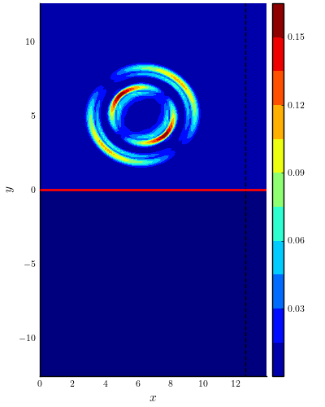 | 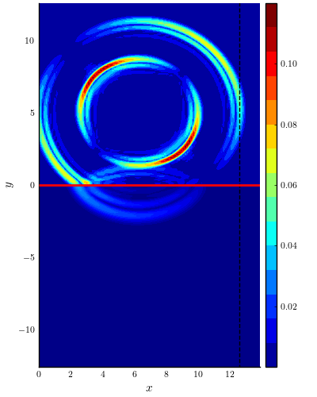 | 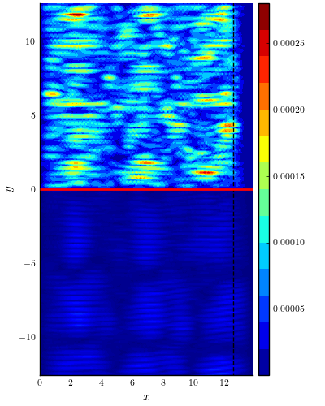 


`t = 1.0` | `t = 2.0` | `t = 40.0` |
-- | -- | -- |
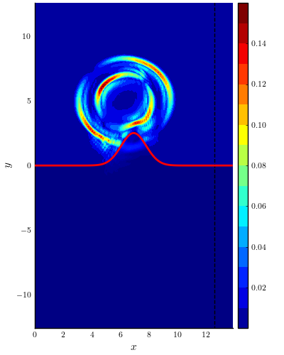 | 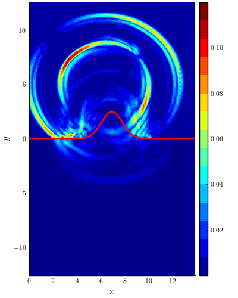 | 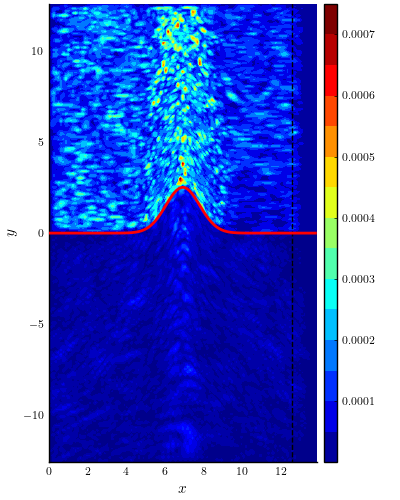 

## Convergence of PML

 | 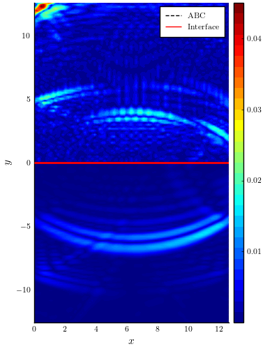 |
-- | -- |
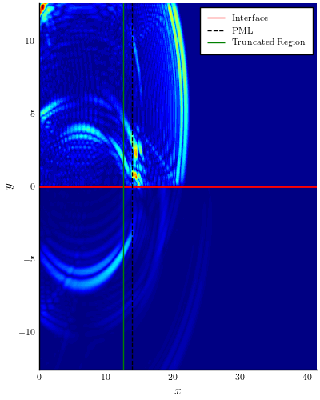 | 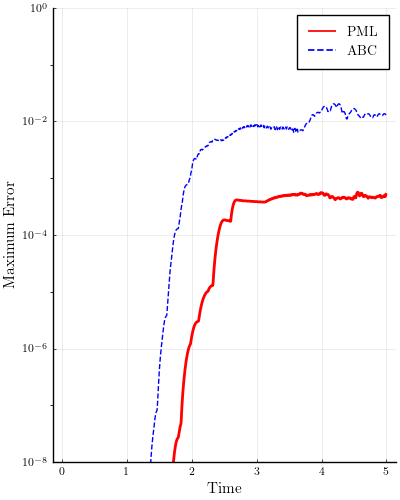 |

## 4-layer example

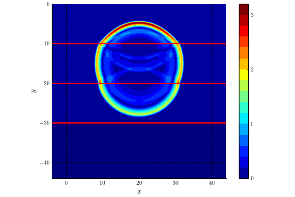 | 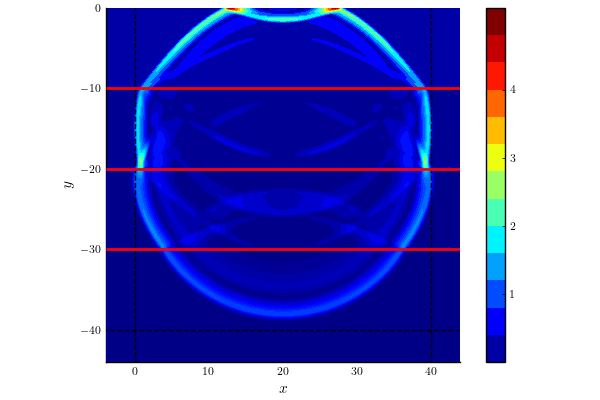 | 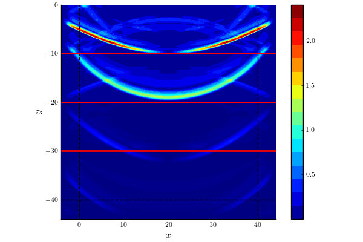
-- | -- | -- |

## Marmousi Model

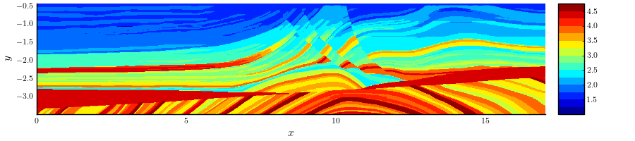 |
-- |
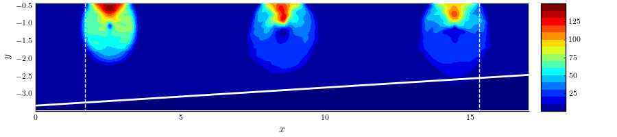 | 
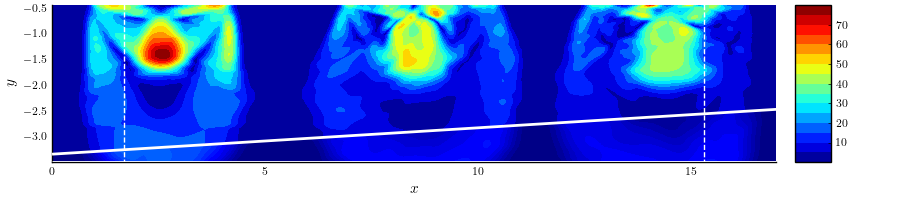 | 

# References