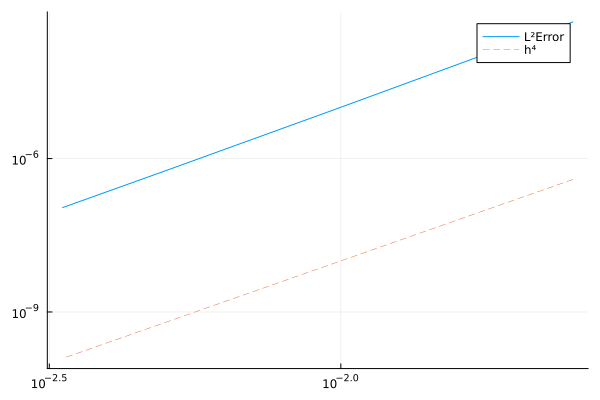
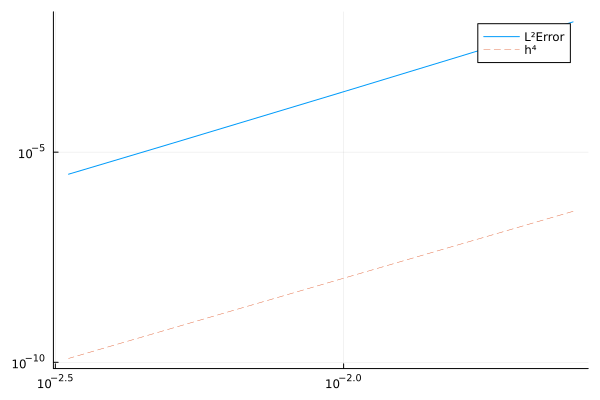
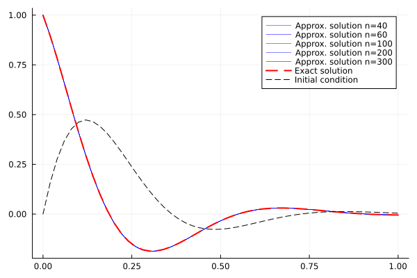
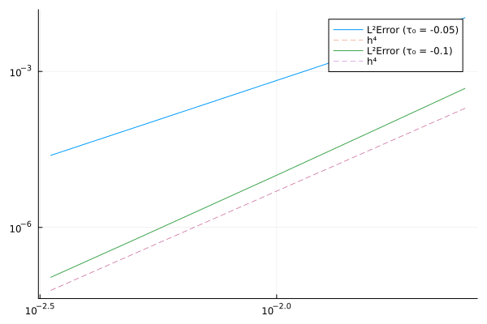
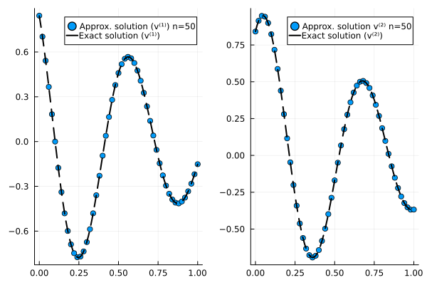

# SBP.jl

Contains code to implement the summation by parts finite difference methods for some problems.

## Advection-diffusion equation

The code can be found in the `MY_SBP/sbp_sat_advection_eq.jl` folder. Consider the one-dimensional model problem [(Mattsson, K. and Nordström, J., 2004)](https://www.sciencedirect.com/science/article/pii/S0021999104000932?via%3Dihub)

$$
\begin{align*}
  u_t + au_x &= \epsilon u_{xx}, \quad 0\le x \le 1, \quad t \ge 0\\
  u(x,0) &= f(x),\\
  \alpha u(0,t) + u_x(0,t) &= g_0(t),\\
  \beta u(1,t) + u_x(1,t) &= g_1(t).\\
\end{align*}
$$

Assuming an exact solution to the problem

$$
u(x,t) = \sin ({w(x-ct)})e^{-bx}
$$

with the parameters

$$
\begin{align*}
  &\alpha = 1, \quad \beta = 0, \quad c = 2, \quad a = 1,\\
  &b = \frac{c-a}{2\epsilon}, \quad w = \frac{\sqrt{c^2 - a^2}}{2\epsilon}
\end{align*}
$$

Solving the problem using the SBP finite difference method and using Simultaneous Approximation Term (SAT) for applying the boundary condition:

Solution at `T=1.0` s | |
--- | --- |
 | 
Solution at `T=4.0` s |
 |  |

The numerical values of the convergence rates at `T=1.0` s and `T=4.0` s are $[4.2067, 4.1841, 4.1289, 4.0833]$ and $[ 4.1777, 4.1718, 4.1282, 4.0863]$, respectively. The spatial axis is discretized using $N = 30,60,100,200,300$ points (similar to the paper) and using the SBP method whose order of accuracy is 4 in the interior. The temporal direction was discretized using the fourth order Runge-Kutta scheme with $\Delta t = 5\times 10^{-5}$. The observed rate of convergence in the spatial direction and is in agreement with the theory. On invalidating the penalty parameter choice by taking $\tau_0 = -\epsilon/2$ instead of $\tau_0 = -\epsilon$:

https://github.com/Balaje/SBP-PML/blob/76dda6ccdb01237c5dfcf93c1701a8ea70f2cc6e/MY_SBP/sbp_sat_advection_eq.jl#L49

we observe that the rate of convergence is close to $3$ instead of $4$. This can be seen in the figures below

 |  |
--- | --- |

The numerical values of the convergence rates is $[3.0323, 3.0295, 3.0204, 3.0130]$.

## Incomplete parabolic problem

Now I solve the incomplete parabolic problem

$$
\begin{align*}
  u_t + Cu_x &= D u_{xx} + F(x,t), \quad 0 \le x \le 1, \quad t \ge 0\\
  u(x, 0) &= f(x), \quad t \ge 0\\
  L_0 u &= g_0(t), \quad x = 0, \quad t \ge 0\\
  L_1 u &= g_1(t), \quad x = 1, \quad t \ge 0 
\end{align*}
$$

from [(Mattsson, K. and Nordström, J., 2004)](https://www.sciencedirect.com/science/article/pii/S0021999104000932?via%3Dihub) using the fourth-order SBP method with the diagonal norm. We observe a suboptimal convergence rate ($\approx 3$) which was also observed in the paper. The code can be found in `MY_SBP/sbp_sat_incomplete_parabolic.jl`.

 |  |
--- | --- |

## References

- Mattsson, K. and Nordström, J., 2004. Summation by parts operators for finite difference approximations of second derivatives. Journal of Computational Physics, 199(2), pp.503-540.
