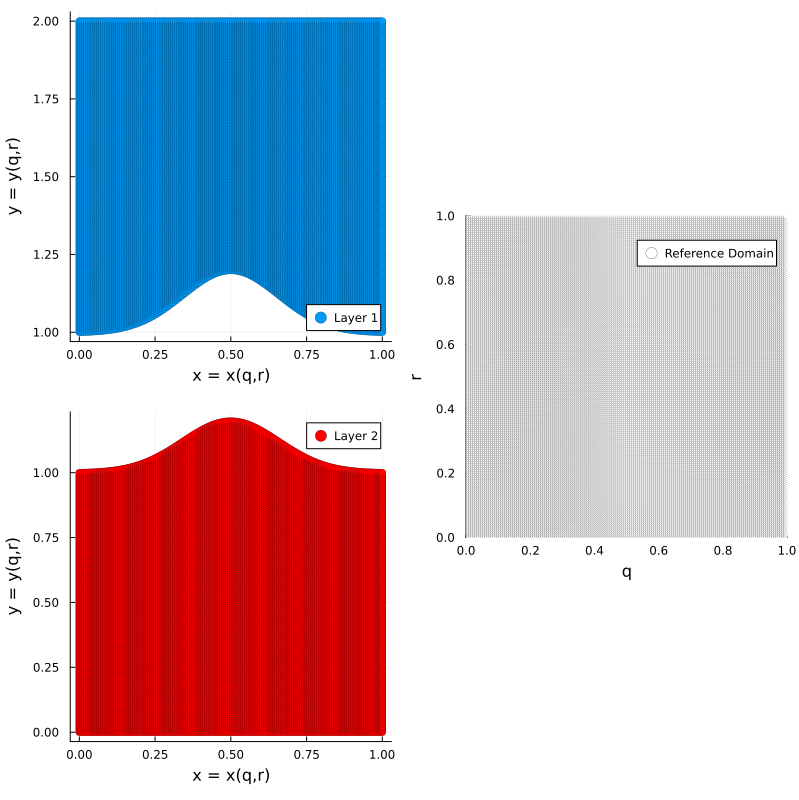
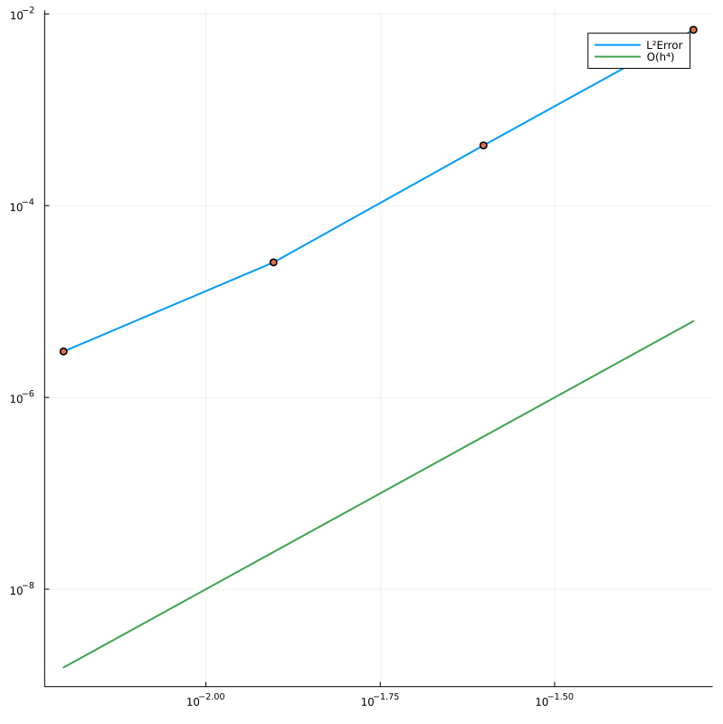
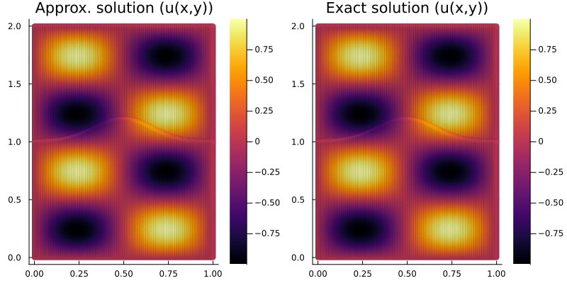
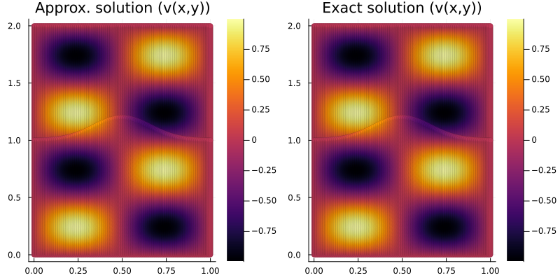

# SBP.jl

Contains code to implement the summation by parts finite difference methods for some problems. To use this package, type the following in the Julia prompt:

```julia
julia> ]
pkg> activate /path/to/this/project
julia> using SBP
```

I have added only the fourth-order SBP operators in this code. To get the SBP operators corresponding to the constant coefficients

```julia
sbp = SBP_1_2_CONSTANT_0_1(n+1) # Get the SBP operators
```


## Advection-diffusion equation

The code can be found in the `examples/sbp_sat_advection_eq.jl` folder. Consider the one-dimensional model problem [(Mattsson, K. and Nordström, J., 2004)](https://www.sciencedirect.com/science/article/pii/S0021999104000932?via%3Dihub)

$$
\begin{align*}
  u_t + au_x &= \epsilon u_{xx}, \quad 0\le x \le 1, \quad t \ge 0\\
  u(x,0) &= f(x),\\
  \alpha u(0,t) + u_x(0,t) &= g_0(t),\\
  \beta u(1,t) + u_x(1,t) &= g_1(t).\\
\end{align*}
$$

Assuming an exact solution to the problem

$$
u(x,t) = \sin ({w(x-ct)})e^{-bx}
$$

with the parameters

$$
\begin{align*}
  &\alpha = 1, \quad \beta = 0, \quad c = 2, \quad a = 1,\\
  &b = \frac{c-a}{2\epsilon}, \quad w = \frac{\sqrt{c^2 - a^2}}{2\epsilon}
\end{align*}
$$

Solving the problem using the SBP finite difference method and using Simultaneous Approximation Term (SAT) for applying the boundary condition:

Solution at `T=1.0` s | |
--- | --- |
 | 
**Solution at `T=4.0` s** | |
 |  |

The numerical values of the convergence rates at `T=1.0` s and `T=4.0` s are $[4.2067, 4.1841, 4.1289, 4.0833]$ and $[ 4.1777, 4.1718, 4.1282, 4.0863]$, respectively. The spatial axis is discretized using $N = 30,60,100,200,300$ points (similar to the paper) and using the SBP method whose order of accuracy is 4 in the interior. The temporal direction was discretized using the fourth order Runge-Kutta scheme with $\Delta t = 5\times 10^{-5}$. The observed rate of convergence in the spatial direction and is in agreement with the theory. On invalidating the penalty parameter choice by taking $\tau_0 = -\epsilon/2$ instead of $\tau_0 = -\epsilon$:

https://github.com/Balaje/Summation-by-parts/blob/master/examples/sbp_sat_advection_eq.jl#L64

we observe that the rate of convergence is close to $3$ instead of $4$. This can be seen in the figures below

 |  |
--- | --- |

The numerical values of the convergence rates is $[3.0323, 3.0295, 3.0204, 3.0130]$.
	
## Incomplete parabolic problem

Now I solve the incomplete parabolic problem

$$
\begin{align*}
  u_t + Cu_x &= D u_{xx} + F(x,t), \quad 0 \le x \le 1, \quad t \ge 0\\
  u(x, 0) &= f(x), \quad t \ge 0\\
  L_0 u &= g_0(t), \quad x = 0, \quad t \ge 0\\
  L_1 u &= g_1(t), \quad x = 1, \quad t \ge 0 
\end{align*}
$$

from [(Mattsson, K. and Nordström, J., 2004)](https://www.sciencedirect.com/science/article/pii/S0021999104000932?via%3Dihub) using the fourth-order SBP method with the diagonal norm. We observe a suboptimal convergence rate ($\approx 3$) which was also observed in the paper. The code can be found in `examples/sbp_sat_incomplete_parabolic.jl`.

 |  |
--- | --- |


## Arbitrary domain

Arbitrary domains can be handled using [Transfinite Interpolation](https://en.wikipedia.org/wiki/Transfinite_interpolation). Any point in the physical domain can be mapped to the reference domain using the transfinite interpolation. We can then solve the PDE in the reference domain.


## Single-Layer Linear Elasticity

We consider the following PDE

$$
\begin{align*}
  \mathbf{u}_{tt} = \nabla \cdot  \sigma + \mathbf{f}, &\quad \mathbf{x} \in \Omega = [0,1]^2, \quad t>0\\
  \mathbf{u}(x,0) = \mathbf{{u}_0(x)}, &\quad \mathbf{x} \in \Omega\\
  \sigma \cdot \mathbf{n} = \bf{g}(t), &\quad \mathbf{x} \in \partial\Omega, \quad t>0
\end{align*}
$$

where

$$
\mathbf{u}(\mathbf{x},t) = 
    \begin{bmatrix}
      u(\mathbf{x},t)\\
      v(\mathbf{x},t)
    \end{bmatrix}, \qquad 
\sigma(\mathbf{u}) = 
    \begin{bmatrix}
      A(\mathbf{x})\frac{\partial \mathbf{u}}{\partial x} + C(\mathbf{x})\frac{\partial \mathbf{u}}{\partial y}&
      C^T(\mathbf{x})\frac{\partial \mathbf{u}}{\partial x} + B(\mathbf{x})\frac{\partial \mathbf{u}}{\partial y}\\
    \end{bmatrix}, \qquad \mathbf{f} = \mathbf{f}(\mathbf{x},t),
$$

are the displacement field and the Cauchy Stress tensor, respectively. The quantity $\mathbf{n}$ denotes the outward unit normal on the boundary. The material properties 

$$
  A(\mathbf{x}), B(\mathbf{x}) \quad \text{and} \quad C(\mathbf{x})
$$

are symmetric matrices which are generally functions of the spatial coordinates. We then solve the PDE in the unit square using the 4th order SBP method. The script `examples/LinearElasticity/1_layer_linear_elasticity.jl` contains the code to solve the PDE in an arbitrary domain. We assume an exact solution

$$
\mathbf{u}(\mathbf{x},t) = 
\begin{bmatrix}
  \sin(\pi x)\sin(\pi y)\sin(\pi t)\\
  \sin(2\pi x)\sin(2\pi y)\sin(\pi t)  
\end{bmatrix}\\\\
$$

and compute the right-hand side $\mathbf{f}$ and the boundary data $\mathbf{g}$. We consider a uniform two-dimensional discretization with $N = [11,21,31,41,51]$ points. To discretize the temporal direction, we use the Crank Nicolson scheme with $\Delta t = 10^{-3}$ and solve till final time $T = 1.25$ s. Following are the approximate and exact solutions with $N = 51$ points. 

 |  
-- | -- |

The $L^2$-error and the convergence rates are as follows

``` julia 
julia> L²Error
5-element Vector{Float64}:
 0.01675066748858688
 0.0010581963168786465
 0.00018482019369399396
 5.387918811243126e-5
 2.111002788292322e-5

julia> rate = log.(L²Error[2:end]./L²Error[1:end-1])./log.(h[2:end]./h[1:end-1])
4-element Vector{Float64}:
 3.9845393793309083
 4.303545948944458
 4.2847270008177825
 4.199073174065968
```

Convergence Rates |
--- |
 |

The code now works for problems in arbitrary domain:

 |  |  | 
--- | --- | --- |

``` julia
julia> rate
6-element Vector{Float64}:
 3.2746487909958084
 3.7040378918078023
 3.9304181708948893
 4.0365715322662075
 4.0870114543739
 4.111380600861835

julia> L²Error
7-element Vector{Float64}:
 0.006591573645793299
 0.0017472380550776494
 0.0006019691925094348
 0.00025042483107953257
 0.00011996557109679588
 6.389168322477752e-5
 3.689923513170043e-5
```

## Two-Layer Linear Elasticity

The code to solve the two-layer elasticity problem is given in `examples/LinearElasticity/2_layer_linear_elasticity.jl`. The problem contains two domains, each of which is transformed to the reference grid. At the interface between the two domains, continuity of displacements and the traction is enforced. The method is discussed in [Duru and Virta, 2014](https://doi.org/10.1016/j.jcp.2014.08.046).

$$
\begin{align*}
\sigma_1(\mathbf{u}_1) \cdot \mathbf{n} &= \sigma_2(\mathbf{u}_2) \cdot \mathbf{n},\\
\mathbf{u}_1 &= \mathbf{u}_2
\end{align*}
$$

In all the experiments, we assume the following exact solution for the numerical tests on both domains

$$
\begin{align*}
	u(x,y,t) &= \sin(2\pi x)\sin(2\pi y)\cos(2\pi t)\\
	v(x,y,t) &= -\sin(2\pi x)\sin(2\pi y)\cos(2\pi t)\\		
\end{align*}
$$

The material properties, i.e., the Young's modulus and the Poisson's ratio, are $\mu = 1.0$ units and $\lambda = 2.0$, respectively. The density of the material $\rho = 1.0$ units. The right-hand side and the initial conditions are computed using the exact solution. The same material properties are considered on both layers. In addition, we apply homogeneous Neumann boundary conditions on all the boundaries other than the interface. We take $N = 21, 41, 81, 161$ grid points in the spatial axis, unless otherwise specified. We use the Crank Nicolson scheme to discretize the temporal axis, with $\Delta t = 10^{-3}$ unless otherwise specified. We solve the problem till the final time $T=0.5$.

## Examples:

### Example 1:

In this example, we consider a vanilla straight-line interface at $y=1$ which separates the two domains $[0,1] \times [0,1]$ and $[0,1] \times [1,2]$. The boundary of the domain is parametrized by the following curves
- Layer 1: 
  - Left: $c_0(r) = [0, r+1]$
  - Bottom: $c_1(q) = [q, 1]$ (interface)
  - Right: $c_2(r) = [1, r+1]$
  - Top: $c_3(q) = [q, 2]$
- Layer 2:
  - Left: $c_0(r) = [0, r]$
  - Bottom: $c_1(q) = [q, 0]$
  - Right: $c_2(r) = [1, r]$
  - Top: $c_3(q) = [q, 1]$ (interface)

We have the following results:

Computational domain | Convergence Rates |
--- | --- |
 |  |

The solution obtained from the code is 

 |  | 
--- | --- | 

```julia
julia> L²Error
4-element Vector{Float64}:
 0.0029292191489991137
 0.00015097078687655857
 7.816432852803662e-6
 2.7961746423513113e-6

julia> rate
3-element Vector{Float64}:
  4.278174814683486
  4.271615240153228
  1.4830558912540412
```

We generally observe optimal rate of convergence for this problem.

### Example 2:

For Example 2, we assume the following boundaries for the two layers. 
- Layer 1: 
  - Left: $c_0(r) = [0, r+1]$
  - Bottom: $c_1(q) = [q, 1]$ (interface)
  - Right: $c_2(r) = [1, r+1]$
  - Top: $c_3(q) = [q, 2 + 0.1\sin(2\pi q)]$
- Layer 2:
  - Left: $c_0(r) = [0, r]$
  - Bottom: $c_1(q) = [q, 0.1\sin(2\pi q)]$
  - Right: $c_2(r) = [1, r]$
  - Top: $c_3(q) = [q, 1]$ (interface)

Here we add a curved boundary on the top and bottom, keeping the interface a straight line. This is intened to check if the interface implementation of the traction is correct. Following are the sparsity pattern of the surface Jacobian on the interface.

 |  |
--- | --- |

The surface Jacobian arises in the traction term due to the transfinite interpolation. Following are the results and the convergence rates for Example 2.

Computational domain | Convergence Rates |
--- | --- |
 |  |

The solution obtained from the code is 

 |  | 
--- | --- | 

```julia
julia> L²Error
5-element Vector{Float64}:
 0.007558173340899469
 0.00045388123034475147
 2.5618346320238604e-5 
 3.0199888379049195e-6

julia> rate
4-element Vector{Float64}:
 4.057650872194422
 4.147065571813102
 3.0845622294783666
```

Again, we observe optimal convergence rates for this problem. This shows that there seems to be no issue having the surface Jacobian on the traction term on the interface.

### Example 3:

We consider the following computational domain. This example problem can be found in [Duru and Virta, 2014](https://doi.org/10.1016/j.jcp.2014.08.046). The boundary of the domain is parametrized by the following curves
- Layer 1: 
  - Left: $c_0(r) = [0, r+1]$
  - Bottom: $c_1(q) = [q, 1 + 0.2\sin(2\pi q)]$ (interface)
  - Right: $c_2(r) = [1, r+1]$
  - Top: $c_3(q) = [q, 2]$
- Layer 2:
  - Left: $c_0(r) = [0, r]$
  - Bottom: $c_1(q) = [q, 0]$
  - Right: $c_2(r) = [1, r]$
  - Top: $c_3(q) = [q, 1 + 0.2\sin(2\pi q)]$ (interface)

We have the following results:

Computational domain | Convergence Rates |
--- | --- |
 |  |

The solution obtained from the code is 

 |  | 
--- | --- | 

The following rate of convergence is observed with the current parameters in the code.

```julia
julia> L²Error
4-element Vector{Float64}:
  0.016210862015016134
  0.0012554598913067554
  0.00012708168659424516
  1.736858752050089e-5

julia> rate
3-element Vector{Float64}:
  3.6906729643333986
  3.304387891506614
  2.8712038038632355
```

With $N=21,31,41,51,61$ we observe the following

```julia
julia> L²Error
5-element Vector{Float64}:
 0.016066707314881114
 0.0036017365712484144
 0.0012300006875771003
 0.0005560646265402666
 0.0003022495249636241

julia> rate
4-element Vector{Float64}:
 3.687945330926127
 3.7346831260966966
 3.557734384058937
 3.343716536727846
```

~~The convergence rates seem to be optimal but it appears to reduce to 3.5. Not sure why this happens, maybe due to the choice in the penalty term for the interface conditions?~~ This problem seems to be much well-behaved where the interface is a Gaussian that has a smooth tail: The boundary of the domain is parametrized by the following curves
- Layer 1: 
  - Left: $c_0(r) = [0, r+1]$
  - Bottom: $c_1(q) = \left[q, 1 + 0.2 \left(e^{-20(q-0.5)^2}\right) \right]$ (interface)
  - Right: $c_2(r) = [1, r+1]$
  - Top: $c_3(q) = [q, 2]$
- Layer 2:
  - Left: $c_0(r) = [0, r]$
  - Bottom: $c_1(q) = [q, 0]$
  - Right: $c_2(r) = [1, r]$
  - Top: $c_3(q) = \left[q, 1 + 0.2 \left(e^{-20(q-0.5)^2}\right) \right]$ (interface)

Computational domain | Convergence Rates |
--- | --- |
 |  |

 |  | 
--- | --- | 

Here we take $\Delta t = 5\times 10^{-4}$.

```julia
# Δt = 5e-4
julia> L²Error
5-element Vector{Float64}:
  0.006826340978433765
  0.000425586540937818
  2.611151878566523e-5
  1.9481550103655963e-6

julia> rate
3-element Vector{Float64}:
  4.003588047602191
  4.026694246642176
  3.7445059958163975
```

The issue also seems to be partly due to time stepping. Reducing $\Delta t$ from $10^{-3}$ to $5\times 10^{-4}$ seem to help.

```julia
# Δt = 5e-4
julia> rate
3-element Vector{Float64}:
 4.003588047602191
 4.026694246642176
 3.7445059958163975

# Δt = 1e-3
julia> rate
3-element Vector{Float64}:
 4.00548755266784
 4.0519597741820155
 3.086414419085599
```

### Example 4:

In this example, the boundary of the domain is parametrized by the following curves
- Layer 1: 
  - Left: $c_0(r) = [0 + 0.1\sin(2\pi r), r+1]$
  - Bottom: $c_1(q) = [q, 1]$ (interface)
  - Right: $c_2(r) = [1 + 0.1\sin(2\pi r), r+1]$
  - Top: $c_3(q) = [q, 2]$
- Layer 2:
  - Left: $c_0(r) = [0 + 0.1\sin(2\pi r), r]$
  - Bottom: $c_1(q) = [q, 0]$
  - Right: $c_2(r) = [1 + 0.1\sin(2\pi r), r]$
  - Top: $c_3(q) = [q, 1]$ (interface)

We add a curved boundary on the left and right-hand sides of the domain but keep the interface a straight line. This does not do anything to the interface condition, i.e., the surface Jacobian is still equal to 1 on the interface. But regardless, we still perform a convergence test.

We have the following results:

Computational domain | Convergence Rates |
--- | --- |
 |  |

The solution obtained from the code is 

 |  | 
--- | --- | 

The following rate of convergence is observed with $\Delta t = 10^{-3}$:

```julia
julia> L²Error
4-element Vector{Float64}:
 0.012935291001307055
 0.0007842570244329608
 4.413028838750284e-5
 3.3462277406906936e-6

julia> rate
3-element Vector{Float64}:
 4.043842153976925
 4.151485465716138
 3.721161633112315
```

This time, we observe optimal convergence rates.

### Example 5:

In this example, the boundary of the domain is parametrized by the following curves
- Layer 1: 
  - Left: $c_0(r) = [0 + 0.1\sin(2\pi r), r+1]$
  - Bottom: $c_1(q) = [q, 1]$ (interface)
  - Right: $c_2(r) = [1 + 0.1\sin(2\pi r), r+1]$
  - Top: $c_3(q) = [q, 2 + 0.1\sin(2\pi q)]$
- Layer 2:
  - Left: $c_0(r) = [0 + 0.1\sin(2\pi r), r]$
  - Bottom: $c_1(q) = [q, 0 + 0.1\sin(2\pi q)]$
  - Right: $c_2(r) = [1 + 0.1\sin(2\pi r), r]$
  - Top: $c_3(q) = [q, 1]$ (interface)

Now we have a straight-line interface, but we add curved boundaries on the rest of the domain. This should change the surface Jacobian for the interface condition. We have the following results:

Computational domain | Convergence Rates |
--- | --- |
 |  |

The solution obtained from the code is 

 |  | 
--- | --- | 

The following rate of convergence is observed with the current parameters in the code.

```julia
julia> L²Error
4-element Vector{Float64}:
 0.030348222878644658
 0.0060687619680976235
 0.0006768305078532689
 4.898596393252745e-5

julia> rate
3-element Vector{Float64}:
 2.3221378973273095
 3.1645357317336233
 3.7883542641706605
```

~~We observe that the convergence rates drop to $\approx 3$.~~ The convergence rates eventually reach 4.

### Example 6:

In this example, the boundary of the domain is parametrized by the following curves
- Layer 1: 
  - Left: $c_0(r) = [0 + 0.1\sin(2\pi r), r+1]$
  - Bottom: $c_1(q) = [q, 1 + 0.1\sin(2\pi q)]$ (interface)
  - Right: $c_2(r) = [1 + 0.1\sin(2\pi r), r+1]$
  - Top: $c_3(q) = [q, 2 + 0.1\sin(2\pi q)]$
- Layer 2:
  - Left: $c_0(r) = [0 + 0.1\sin(2\pi r), r]$
  - Bottom: $c_1(q) = [q, 0 + 0.1\sin(2\pi q)]$
  - Right: $c_2(r) = [1 + 0.1\sin(2\pi r), r]$
  - Top: $c_3(q) = [q, 1 + 0.1\sin(2\pi q)]$ (interface)

Lastly, we add curved boundaries on both domains. We have the following results:

Computational domain | Convergence Rates |
--- | --- |
 |  |

The solution obtained from the code is 

 |  | 
--- | --- | 

The following rate of convergence is observed with the current parameters in the code. In this example I take $N = 21,31,41,51,61$.

```julia
# Δt = 1e-3
julia> L²Error
5-element Vector{Float64}:
 0.04296175304105988
 0.01574910722885202
 0.007227511185722746
 0.0037390561406167116
 0.0020981987167981776

julia> rate
4-element Vector{Float64}:
 2.4750010688314252
 2.707464287141587
 2.953531607478651
 3.1688737095831887
```

This problem seems to be difficult to solve due a combination of the distortion and time stepping. Further investigation is required to see if this can be improved.

# References

- Mattsson, K. and Nordström, J., 2004. Summation by parts operators for finite difference approximations of second derivatives. Journal of Computational Physics, 199(2), pp.503-540.
- Duru, K., Virta, K., 2014. Stable and high order accurate difference methods for the elastic wave equation in discontinuous media. Journal of Computational Physics 279, 37–62. https://doi.org/10.1016/j.jcp.2014.08.046
