# SBP.jl

Contains code to implement the summation by parts finite difference methods for some problems. To use this package, type the following in the Julia prompt:

```julia
julia> ]
pkg> activate /path/to/this/project
julia> using SBP
```

Following is the brief description of some sample codes:

- `sbp_sat_advection_eq.jl`: Implements the SBP-SAT method to solve the (scalar) advection-diffusion equation.
   Solution at `T=1.0` s | Convergence rates |
   --- | --- |
    |  |

- `sbp_sat_incomplete_parabolic.jl`: Implements the SBP-SAT method to solve the incomplete parabolic system.
    Solution | Convergence rates |
    --- | --- |
     |  |    
    
- `LinearElasticity/1_layer_linear_elasticity.jl`: Program to solve the elastic-wave equation on a curviliear grid. Also compute the convergence rates using the method, which should be approximately equal to 4.
    Solution |
    --- |
    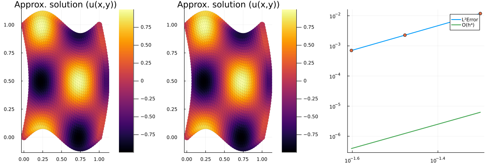 |

- `LinearElasticity/2_layer_linear_elasticity.jl`: Program to solve the elastic-wave equation on two curviliear grids sharing a common interface. The displacement and the traction on the common interface is matched.

    Horizontal Displacement | Vertical Displacement |
    --- | --- |
    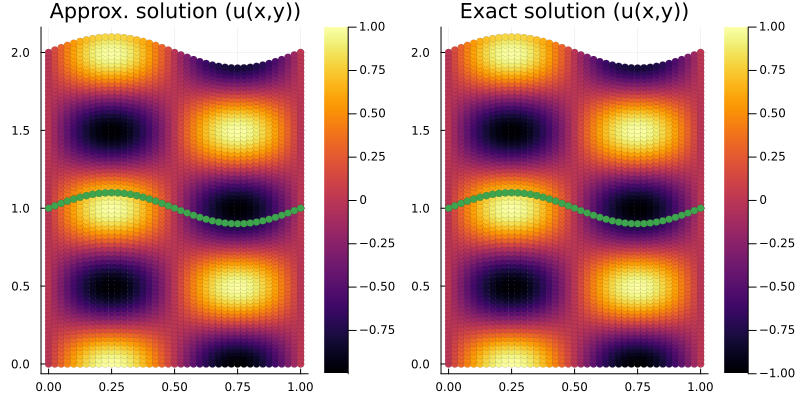 | 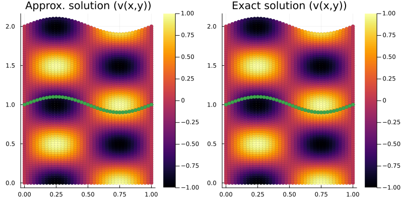    

We discuss the rest of the code below.


## Perfectly Matched Layers.

### Single layer

Wave propagation problems are often formulated in large domains, but needs to simulated in a smaller domain due to computational complexities. The compuational domain thus must be truncated to an appropriate size. Perfectly matched layers provide an absorbing layer which absorbs outgoing waves without relections, and can be used for this task. 

To derive the PML model, we consider the Laplace Transformed elastic wave equation:

$$
\begin{align*}
  \rho s^2 \hat{\mathbf{u}} = \frac{\partial }{\partial x}\left(A \frac{\partial \hat{\mathbf{u}}}{\partial x}\right) + \frac{\partial }{\partial x}\left(C \frac{\partial \hat{\mathbf{u}}}{\partial y}\right) + \frac{\partial }{\partial y}\left(C^T \frac{\partial \hat{\mathbf{u}}}{\partial x}\right) + \frac{\partial }{\partial y}\left(B \frac{\partial \hat{\mathbf{u}}}{\partial y}\right)
\end{align*}
$$

Applying the transformation 

$$
  \frac{d \tilde{x}}{d x} = 1 + \frac{\sigma_x(x)}{\alpha + s} =: S_x, \qquad \frac{d \tilde{y}}{d y} = 1 + \frac{\sigma_y(y)}{\alpha + s} =: S_y
$$

to the transformed PDE and defining the auxiliary variable $\hat{\mathbf{v}}, \hat{\mathbf{w}}, \hat{\mathbf{q}}, \hat{\mathbf{r}}$, we obtain the system of equations

$$
\begin{align*}
  \rho\left( s^2 \mathbf{u} + \sigma_x s(\mathbf{u} - \mathbf{q}) + \sigma_y s(\mathbf{u} - \mathbf{q}) + \sigma_x \sigma_y (\mathbf{u} - \mathbf{q} - \mathbf{r}) \right) &= \frac{\partial }{\partial x}\left(A \frac{\partial \mathbf{u}}{\partial x} + (\sigma_y - \sigma_x) A \mathbf{v}\right) + \frac{\partial }{\partial x}\left(C \frac{\partial \mathbf{u}}{\partial y}\right) + \frac{\partial }{\partial y}\left(B \frac{\partial \mathbf{u}}{\partial y} + (\sigma_x - \sigma_y) B \mathbf{w}\right) + \frac{\partial }{\partial y}\left(C^T \frac{\partial \mathbf{u}}{\partial x}\right)\\
  s \mathbf{v} &= \frac{\partial \mathbf{u}}{\partial x} - (\alpha + \sigma_x)\mathbf{v}\\
  s \mathbf{w} &= \frac{\partial \mathbf{u}}{\partial y} - (\alpha + \sigma_y)\mathbf{w}\\
  s \mathbf{q} &= \alpha(\mathbf{u} - \mathbf{q})\\
  s \mathbf{r} &= \alpha(\mathbf{u} - \mathbf{q}) - \alpha\mathbf{r}
\end{align*}
$$

Inverting the Laplace transformation, we obtain the system:

$$
\begin{align*}
  \rho\left( \frac{\partial^2 \mathbf{u}}{\partial t} + (\sigma_x + \sigma_y)\frac{\partial \mathbf{u}}{\partial t} - \sigma_x \alpha(\mathbf{u} - \mathbf{q}) + \sigma_y \alpha(\mathbf{u} - \mathbf{q}) + \sigma_x \sigma_y (\mathbf{u} - \mathbf{q} - \mathbf{r}) \right) &= \frac{\partial }{\partial x}\left(A \frac{\partial \mathbf{u}}{\partial x} + (\sigma_y - \sigma_x) A \mathbf{v}\right) + \frac{\partial }{\partial x}\left(C \frac{\partial \mathbf{u}}{\partial y}\right) + \frac{\partial }{\partial y}\left(B \frac{\partial \mathbf{u}}{\partial y} + (\sigma_x - \sigma_y) B \mathbf{w}\right) + \frac{\partial }{\partial y}\left(C^T \frac{\partial \mathbf{u}}{\partial x}\right)\\
  \frac{\partial \mathbf{v}}{\partial t} &= \frac{\partial \mathbf{u}}{\partial x} - (\alpha + \sigma_x)\mathbf{v}\\
  \frac{\partial \mathbf{w}}{\partial t} &= \frac{\partial \mathbf{u}}{\partial y} - (\alpha + \sigma_y)\mathbf{w}\\
  \frac{\partial \mathbf{q}}{\partial t} &= \alpha(\mathbf{u} - \mathbf{q})\\
  \frac{\partial \mathbf{r}}{\partial t} &= \alpha(\mathbf{u} - \mathbf{q}) - \alpha\mathbf{r}
\end{align*}
$$

The PML damping functions are generally of the form

$$
\begin{align*}
  \sigma_x(x) = \begin{cases}
                0, & \text{if} \quad x \le L_x\\
                \sigma_0\left( \frac{x-L_x}{\delta}\right)^3 & \text{if} \quad x \ge L_x
              \end{cases}, \qquad 
  \sigma_y(y) = \begin{cases}
                0, & \text{if} \quad y \le L_y\\
                \sigma_0\left( \frac{y-L_y}{\delta}\right)^3 & \text{if} \quad y \ge L_y
              \end{cases}\\
\end{align*}
$$

where $\delta = 0.1L_x$ is the width of the PML and $\alpha = 0.05\sigma_0$. The parameter $\sigma_0$ is the damping strength of the PML. Setting the damping strength equal to $0$ will deactivate the PML along the corresponding direction. We use following characterisitc boundary condition

$$
\begin{align*}
  Z_x \left(\frac{\partial \mathbf{u}}{\partial t} + \sigma_y (\mathbf{u}-\mathbf{q}) -  \sigma_x\sigma_y (\mathbf{u}-\mathbf{q}-\mathbf{r})\right) - A\frac{\partial \mathbf{u}}{\partial x} - C\frac{\partial \mathbf{u}}{\partial y} - (\sigma_y - \sigma_x) A \mathbf{v} &= 0, \qquad x = 0 \quad \text{(LEFT)}\\
  Z_x \left(\frac{\partial \mathbf{u}}{\partial t} + \sigma_y (\mathbf{u}-\mathbf{q}) -  \sigma_x\sigma_y (\mathbf{u}-\mathbf{q}-\mathbf{r})\right) + A\frac{\partial \mathbf{u}}{\partial x} + C\frac{\partial \mathbf{u}}{\partial y} + (\sigma_y - \sigma_x) A \mathbf{v} &= 0, \qquad x = 1.1L_x \quad \text{(RIGHT)}\\
  Z_y \left(\frac{\partial \mathbf{u}}{\partial t} + \sigma_x (\mathbf{u}-\mathbf{q}) -  \sigma_x\sigma_y (\mathbf{u}-\mathbf{q}-\mathbf{r})\right) - C^T\frac{\partial \mathbf{u}}{\partial x} - B\frac{\partial \mathbf{u}}{\partial y} - (\sigma_x - \sigma_y) B \mathbf{w} &= 0, \qquad y = 0 \quad \text{(BOTTOM)}\\
  Z_y \left(\frac{\partial \mathbf{u}}{\partial t} + \sigma_x (\mathbf{u}-\mathbf{q}) -  \sigma_x\sigma_y (\mathbf{u}-\mathbf{q}-\mathbf{r})\right) + C^T\frac{\partial \mathbf{u}}{\partial x} + B\frac{\partial \mathbf{u}}{\partial y} + (\sigma_x - \sigma_y) B \mathbf{w} &= 0, \qquad y = 1.1L_y \quad \text{(TOP)}\\
\end{align*}
$$

Here $Z_x$ and $Z_y$ are the impedance matrices. We now show some examples. Activating the PML damping along the horizontal direction $(x-)$, we see that the waves are damped near the PML. This model allows activating the damping on both axes, resulting in a unified code.

$\sigma_x \ne 0$, $\sigma_y = 0$ | $\sigma_x, \sigma_y = 0$ |
--- | --- |
 | 

Displacement profiles | PML damping |
--- | --- |
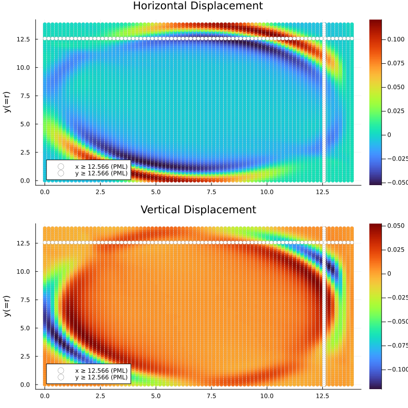 | 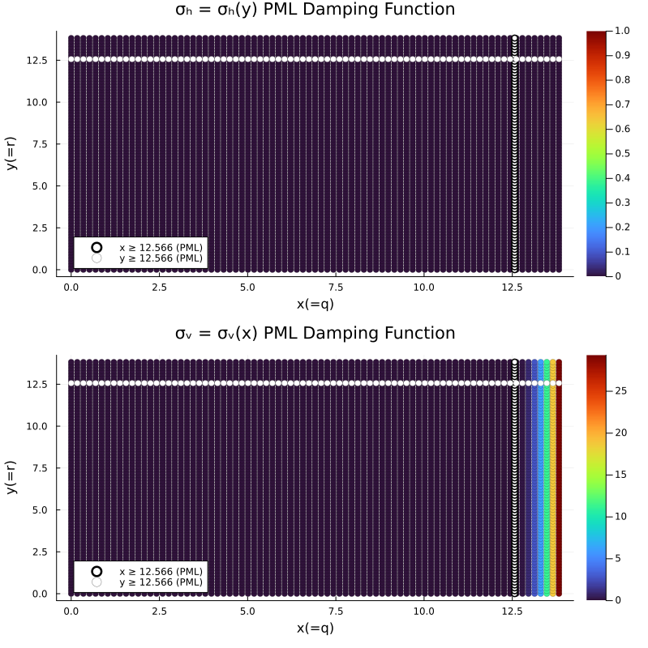 |

Displacement profiles | PML damping |
--- | --- |
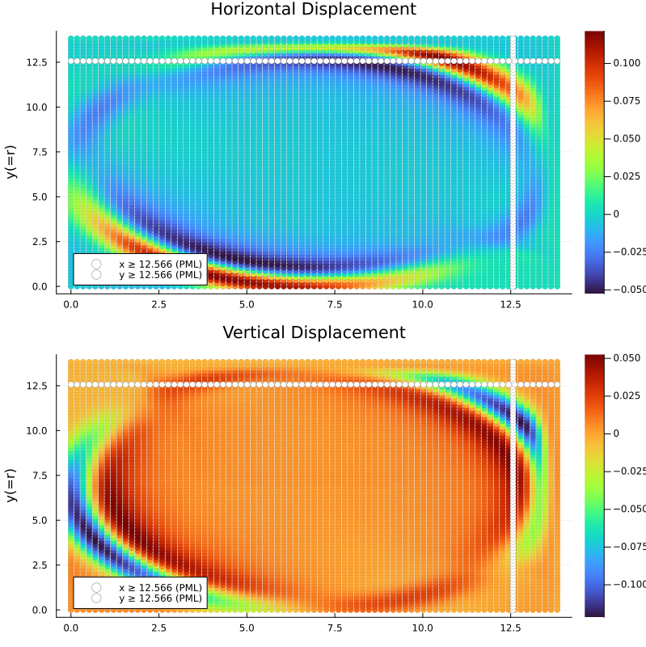 | 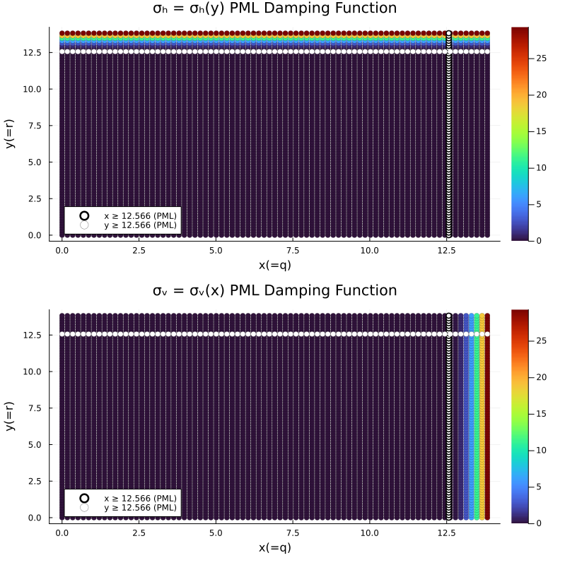 |


### Two Layers

On layered media, we couple the PDE on both layers by matching the traction and the displacement. The traction with the PML damping becomes 

$$
\begin{align*}
  \bm{\tau}^{PML}(\mathbf{u}, \mathbf{v}, \mathbf{w}) = \begin{bmatrix}
                                                          A & C\\   
                                                          C^T & B
                                                      \end{bmatrix}
                                                      \begin{Bmatrix}
                                                          \partial \mathbf{u}/\partial x \\
                                                          \partial \mathbf{u}/\partial y
                                                      \end{Bmatrix} + 
                                                      \begin{bmatrix}
                                                          (\sigma_y - \sigma_x)A & 0\\   
                                                          0 & (\sigma_x - \sigma_y)B
                                                      \end{bmatrix}
                                                      \begin{Bmatrix}
                                                          \mathbf{v} \\
                                                          \mathbf{w}
                                                      \end{Bmatrix}
\end{align*}
$$

Consider two domains $\Omega_1 = [0,1.1L_x] \times [0,1.1L_y]$ and $\Omega_2 = [0,1.1L_x] \times [-1.1L_y,0]$ welded together at $y = 0$. The PML elastic wave equation on the two domains are given by the system

$$
\begin{align*}
  \rho_i\left( \frac{\partial^2 \mathbf{u}_i}{\partial t} + (\sigma_x + \sigma_y)\frac{\partial \mathbf{u}_i}{\partial t} - \sigma_x \alpha(\mathbf{u}_i - \mathbf{q}_i) + \sigma_y \alpha(\mathbf{u}_i - \mathbf{q}_i) + \sigma_x \sigma_y (\mathbf{u}_i - \mathbf{q}_i - \mathbf{r}_i) \right) &= \frac{\partial }{\partial x}\left(A_i \frac{\partial \mathbf{u}_i}{\partial x} + (\sigma_y - \sigma_x) A_i \mathbf{v}\right) + \frac{\partial }{\partial x}\left(C_i \frac{\partial \mathbf{u}}{\partial y}\right) + \frac{\partial }{\partial y}\left(B_i \frac{\partial \mathbf{u}}{\partial y} + (\sigma_x - \sigma_y) B_i \mathbf{w}_i\right) + \frac{\partial }{\partial y}\left(C_i^T \frac{\partial \mathbf{u}_i}{\partial x}\right)\\
  \frac{\partial \mathbf{v}_i}{\partial t} &= \frac{\partial \mathbf{u}_i}{\partial x} - (\alpha + \sigma_x)\mathbf{v}_i\\
  \frac{\partial \mathbf{w}_i}{\partial t} &= \frac{\partial \mathbf{u}_i}{\partial y} - (\alpha + \sigma_y)\mathbf{w}_i\\
  \frac{\partial \mathbf{q}_i}{\partial t} &= \alpha(\mathbf{u}_i - \mathbf{q}_i)\\
  \frac{\partial \mathbf{r}_i}{\partial t} &= \alpha(\mathbf{u}_i - \mathbf{q}_i) - \alpha\mathbf{r}_i
\end{align*}
$$

where i=1,2. On the outer boundaries, we use the characteristic boundary conditions

$$
\begin{align*}
  Z_{ix} \left(\frac{\partial \mathbf{u}_i}{\partial t} + \sigma_y (\mathbf{u}_i-\mathbf{q}_i) -  \sigma_x\sigma_y (\mathbf{u}_i-\mathbf{q}_i-\mathbf{r}_i)\right) - A_i\frac{\partial \mathbf{u}_i}{\partial x} - C_i\frac{\partial \mathbf{u}_i}{\partial y} - (\sigma_y - \sigma_x) A_i \mathbf{v}_i &= 0, \qquad x = 0, \quad i=1,2   \quad \text{(LEFT)}\\
  Z_{ix} \left(\frac{\partial \mathbf{u}_i}{\partial t} + \sigma_y (\mathbf{u}_i-\mathbf{q}_i) -  \sigma_x\sigma_y (\mathbf{u}_i-\mathbf{q}_i-\mathbf{r}_i)\right) + A_i\frac{\partial \mathbf{u}_i}{\partial x} + C_i\frac{\partial \mathbf{u}_i}{\partial y} + (\sigma_y - \sigma_x) A_i \mathbf{v}_i &= 0, \qquad x = 1.1L_x, \quad i=1,2 \quad \text{(RIGHT)}\\
  Z_{1y} \left(\frac{\partial \mathbf{u}_1}{\partial t} + \sigma_x (\mathbf{u}_1-\mathbf{q}_1) -  \sigma_x\sigma_y (\mathbf{u}_1-\mathbf{q}_1-\mathbf{r}_1)\right) + C_1^T\frac{\partial \mathbf{u}_1}{\partial x} + B_1\frac{\partial \mathbf{u}_1}{\partial y} + (\sigma_x - \sigma_y) B_1 \mathbf{w}_1 &= 0, \qquad y = 1.1L_y \quad \text{(BOTTOM)}\\
  Z_{2y} \left(\frac{\partial \mathbf{u}_2}{\partial t} + \sigma_x (\mathbf{u}_2-\mathbf{q}_2) -  \sigma_x\sigma_y (\mathbf{u}_2-\mathbf{q}_2-\mathbf{r}_2)\right) - C_2^T\frac{\partial \mathbf{u}_2}{\partial x} - B_2\frac{\partial \mathbf{u}_2}{\partial y} - (\sigma_x - \sigma_y) B_2 \mathbf{w}_2 &= 0, \qquad y = -1.1L_y \quad \text{(TOP)}\\
\end{align*}
$$

On the interface we match the traction and the displacement, 

$$
\begin{align*}
  C_1^T\frac{\partial \mathbf{u}_1}{\partial x} + B_1\frac{\partial \mathbf{u}_1}{\partial y} + (\sigma_x - \sigma_y) B_1 \mathbf{w}_1 &=  C_2^T\frac{\partial \mathbf{u}_2}{\partial x} + B_2\frac{\partial \mathbf{u}_2}{\partial y} + (\sigma_x - \sigma_y) B_2 \mathbf{w}_2\\
   \mathbf{u}_1 &= \mathbf{u}_2
\end{align*}
$$

We now show some results

$\sigma_x, \sigma_y \ne 0$ | $\sigma_x, \sigma_y = 0$ |
--- | --- |
 | 

We observe that the PML is effective in damping the waves close to the boundary:

$\sigma_x \ne 0$, $\sigma_y \ne 0 0$ | $\sigma_x, \sigma_y \ne 0$ |
--- | --- |
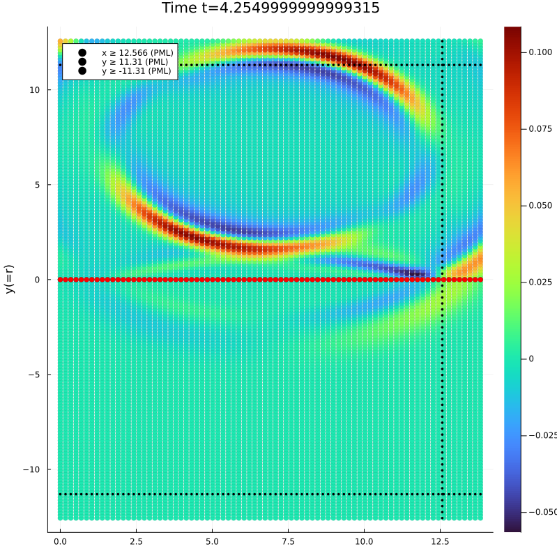 | 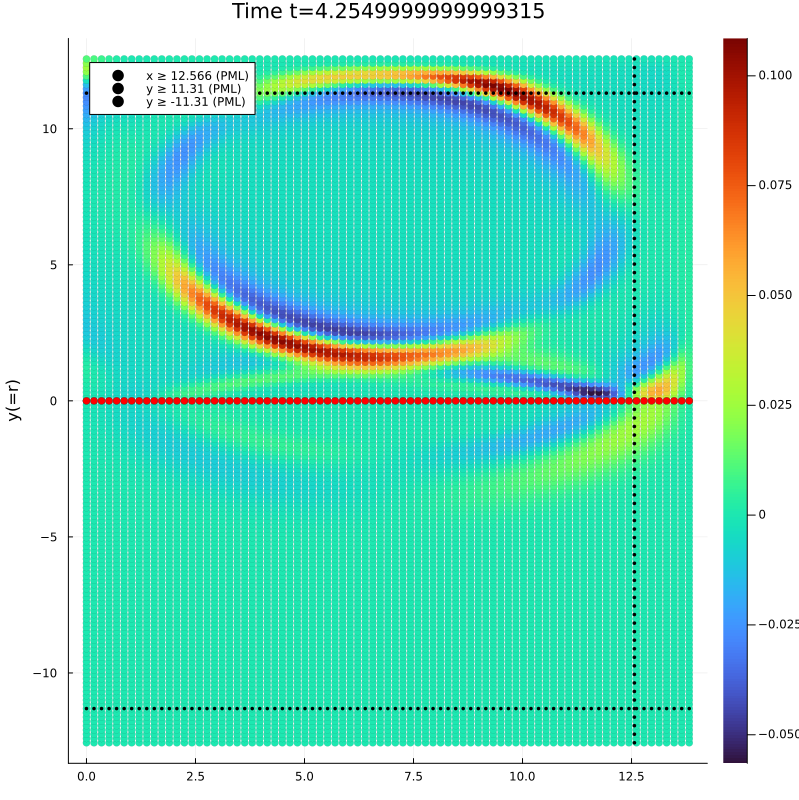

### Curvilinear domains

On curvilinear domains, we show only the two layer case:

We transform the PDE to the reference coordinate systems $(x(q,r),y(q,r)) = (q(x,y),r(x,y))$. Let the resulting Jacobian matrix of the transformation be 

$$
  J = \begin{bmatrix}
          x_q & y_q\\
          x_r & y_r
      \end{bmatrix}, \qquad 
  J^{-1} = \begin{bmatrix}
          q_x & q_y\\
          r_x & r_y
      \end{bmatrix},
$$

Applying the transformation

$$

\frac{\partial(\bullet)}{\partial x} = \frac{\partial (\bullet)}{\partial q}\frac{\partial q}{\partial x} + \frac{\partial (\bullet)}{\partial r}\frac{\partial r}{\partial x}, \qquad \frac{\partial(\bullet)}{\partial y} = \frac{\partial (\bullet)}{\partial q}\frac{\partial q}{\partial y} + \frac{\partial (\bullet)}{\partial r}\frac{\partial r}{\partial y}

$$

The PML Elasticity system becomes

$$
\begin{align*}
  \rho_i\left( \frac{\partial^2 \mathbf{u}_i}{\partial t} + (\sigma_x + \sigma_y)\frac{\partial \mathbf{u}_i}{\partial t} - \sigma_x \alpha(\mathbf{u}_i - \mathbf{q}_i) + \sigma_y \alpha(\mathbf{u}_i - \mathbf{q}_i) + \sigma_x \sigma_y (\mathbf{u}_i - \mathbf{q}_i - \mathbf{r}_i) \right) &= \frac{\partial }{\partial q}\left(\tilde{A}_i \frac{\partial \mathbf{u}_i}{\partial q} + \tilde{A_p}_i \mathbf{v}\right) + \frac{\partial }{\partial q}\left(\tilde{C}_i \frac{\partial \mathbf{u}}{\partial r}\right) + \frac{\partial }{\partial r}\left(\tilde{B}_i \frac{\partial \mathbf{u}}{\partial r} + \tilde{B_p}_i \mathbf{w}_i\right) + \frac{\partial }{\partial r}\left(\tilde{C}_i^T \frac{\partial \mathbf{u}_i}{\partial q}\right)\\
  \frac{\partial \mathbf{v}_i}{\partial t} &= \frac{\partial \mathbf{u}_i}{\partial q} q_x + \frac{\partial \mathbf{u}_i}{\partial r} r_x  - (\alpha + \sigma_x)\mathbf{v}_i\\
  \frac{\partial \mathbf{w}_i}{\partial t} &= \frac{\partial \mathbf{u}_i}{\partial q} q_y + \frac{\partial \mathbf{u}_i}{\partial r} r_y - (\alpha + \sigma_y)\mathbf{w}_i\\
  \frac{\partial \mathbf{q}_i}{\partial t} &= \alpha(\mathbf{u}_i - \mathbf{q}_i)\\
  \frac{\partial \mathbf{r}_i}{\partial t} &= \alpha(\mathbf{u}_i - \mathbf{q}_i) - \alpha\mathbf{r}_i
\end{align*}
$$

where the modified material properties become

$$
\begin{align*}
   \begin{bmatrix}
      \tilde{A}_i & \tilde{C}_i\\   
      \tilde{C}_i^T & \tilde{B}_i
   \end{bmatrix} &= 
    |J_i| (I(2)\otimes J_i^{-1})^T \begin{bmatrix}
                            A_i & C_i\\   
                            C_i^T & B_i
                         \end{bmatrix}(I(2)\otimes J_i^{-1})\\
   \begin{bmatrix}
      \tilde{A_p}_i & 0\\   
      0 & \tilde{B_p}_i
   \end{bmatrix} &=
   |J_i| (I(2)\otimes J_i^{-1})^T \begin{bmatrix}
                            (\sigma_y - \sigma_x) A_i & 0\\   
                            0 & (\sigma_x - \sigma_y) B_i
                         \end{bmatrix} = \begin{bmatrix}
                            (\sigma_y - \sigma_x) J_i^{-1}A_i & 0\\   
                            0 & (\sigma_x - \sigma_y)  J_i^{-1}B_i
                         \end{bmatrix}
\end{align*}
$$

where $i=1,2$ corresponding to the two layers. On the outer boundaries, we use the characteristic boundary conditions

## Non-conforming interfaces

In many layered-media applications, it may be useful to use different grid sizes for the layers. The SBP-SAT method can be extended to such cases using a suitable interpolation operator on the interface. The interface operator needs to be sufficiently accurate while preserving the stability properties of the discrete scheme. The code is given in `./examples/LinearElasticity/non_conforming_2_layer_linear_elasticity.jl`. Following figures show the 2-layer case with `N=21` points in the top layer and `N=41` points in the bottom layer. 

Cartesian Interface | Curvilinear Interface |
--- | --- |
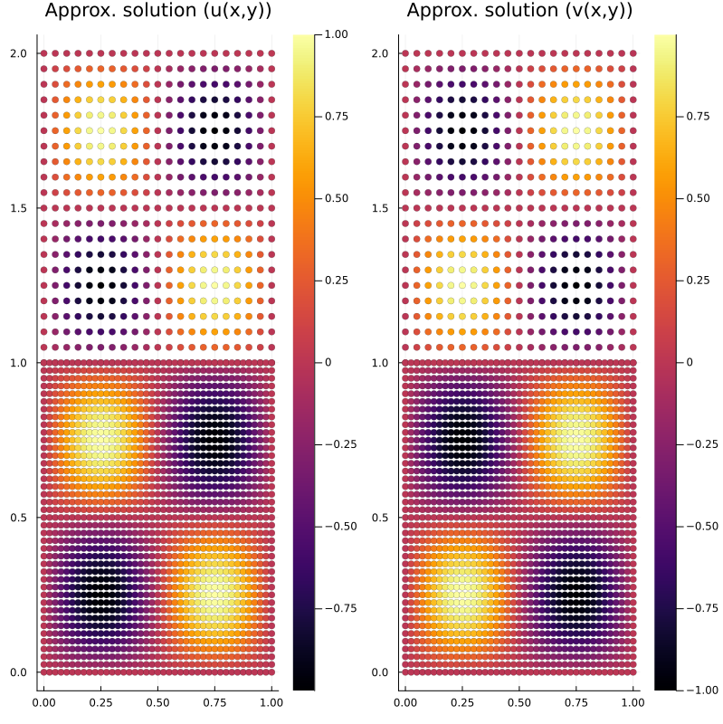 | 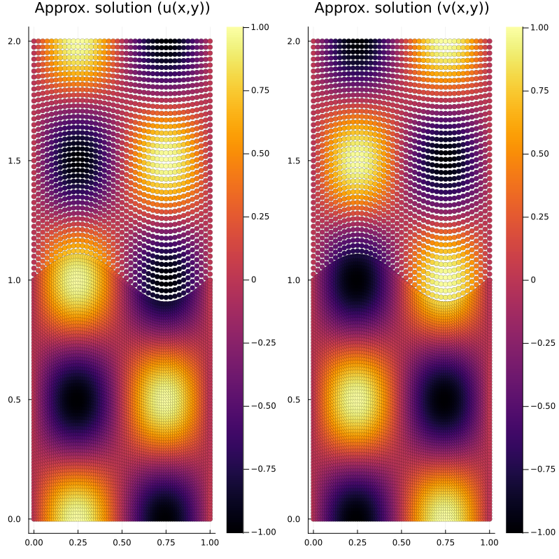 | 

The method is stable in **both cases** - and can be verified by computing the eigenvalues of the stiffness matrix. The eigenvalues are purely real and negative. Using the 2nd order Crank Nicolson Scheme, we solve the problem till final time $T=1.0$ with the time-stepping size $\Delta t = 10^{-3}$. For a flat interface, we observe the following convergence rates.

Mesh Size (h) | Error | Rate |
--- | --- | --- |
1/20 | 0.026211808439636063 | - |
1/30 | 0.008746630256191176 | 2.7068704025812806 |
1/40 | 0.0038020449644579272 | 2.896007509233421 |
1/50 | 0.0019686933629908636 | 2.9495318662548855 |

For the curvilinear interface, we observe the following convergence rates.

Mesh Size (h) | Error | Rate |
--- | --- | --- |
1/20 | 0.030295920639684136 | - |
1/30 | 0.011206971663428154 | 2.4526821090526285 |
1/40 | 0.0053189797099193435 | 2.5905491681617163 |
1/50 | 0.002897981842482318 | 2.7214182045127746 |

We observe a convergence rate of $\approx 3$ in both cases. Following figure shows the maximum-norm error in the solution as a function of time for the curvilinear case. The problem was solved till final time $T=10.0$ s.

Cartesian Interface | Curvilinear Interface | 
--- | --- |
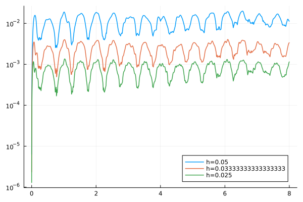 | 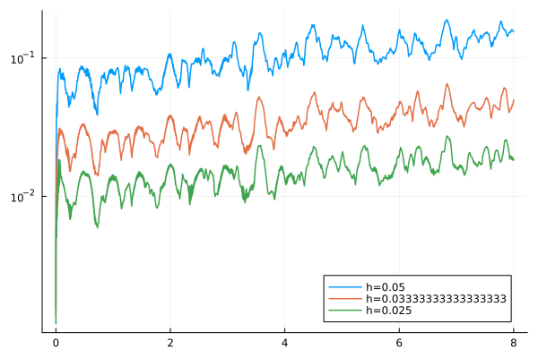 | 

### Combining non-conforming interfaces with conforming interfaces. 

We could also have more sophisticated cases where the domain comprises of different layers with different grid sizes. Following is the solution to the linear elastic equation on a composite domain with different material properties. We have three material interfaces, one conforming interface and two non-conforming:

 | 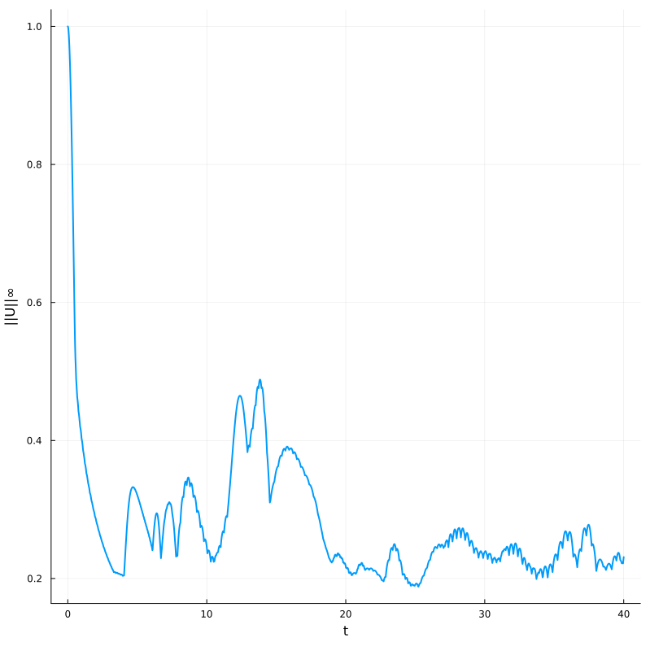 |
--- | --- |

# References

- Mattsson, K. and Nordström, J., 2004. Summation by parts operators for finite difference approximations of second derivatives. Journal of Computational Physics, 199(2), pp.503-540.
- Duru, K., Virta, K., 2014. Stable and high-order accurate difference methods for the elastic wave equation in discontinuous media. Journal of Computational Physics 279, 37–62. https://doi.org/10.1016/j.jcp.2014.08.046
