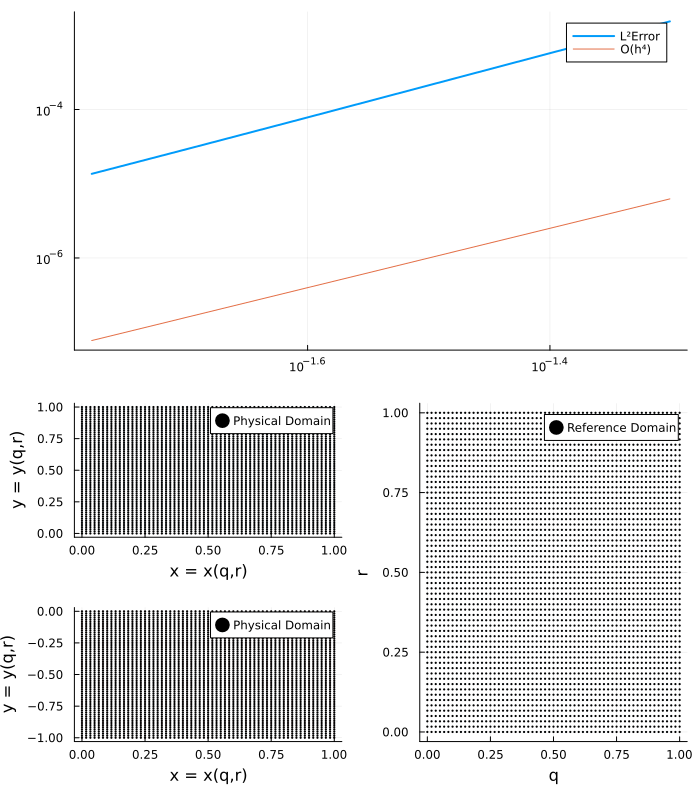
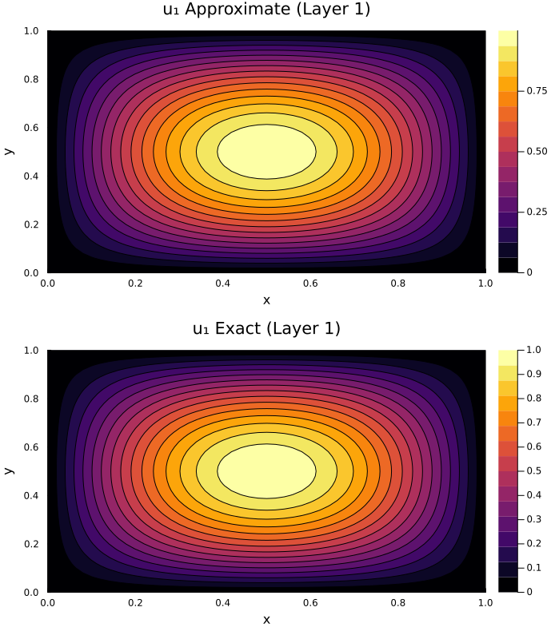
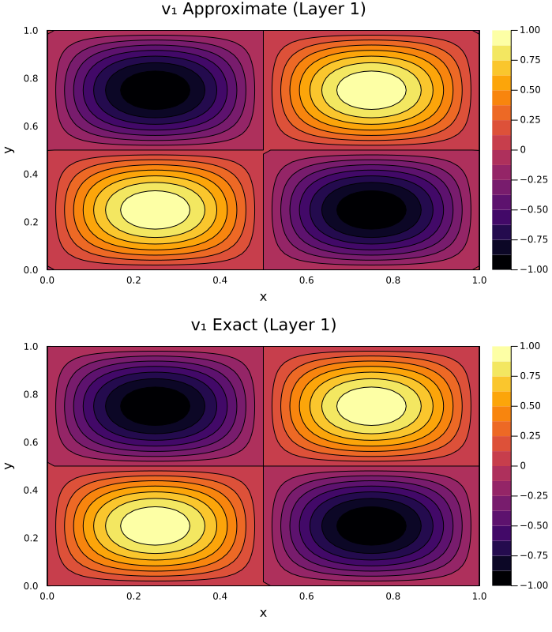
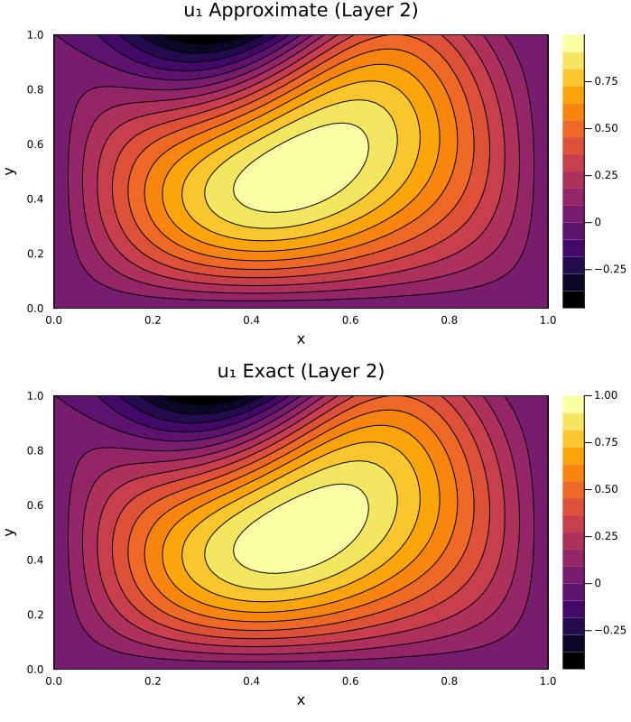
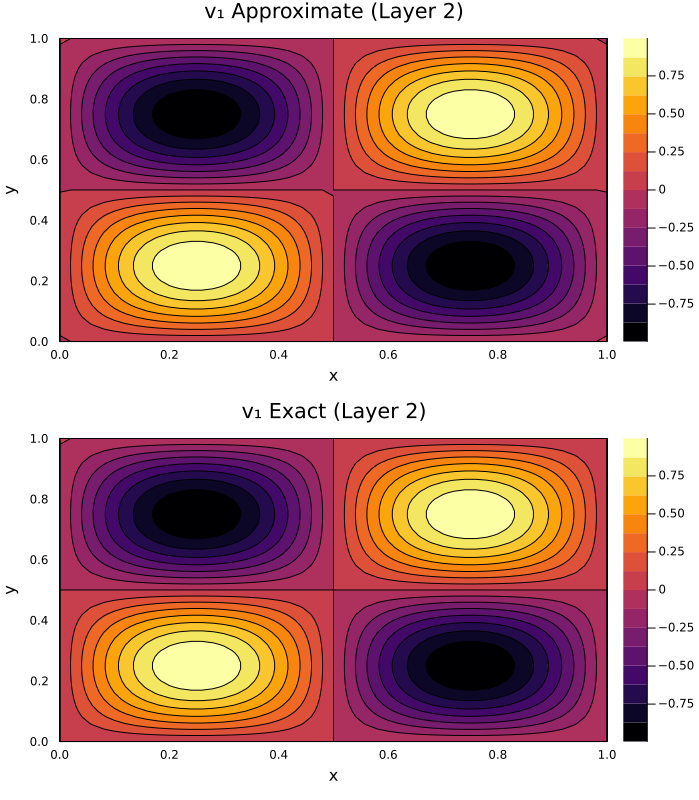

# SBP.jl

Contains code to implement the summation by parts finite difference methods for some problems. To use this package, type the following in the Julia prompt:

```julia
julia> ]
pkg> activate .
julia> using SBP
```

I have added only the fourth-order SBP operators in this code. To get the SBP operators corresponding to the constant coefficients

```julia
sbp = SBP_1_2_CONSTANT_0_1(n+1) # Get the SBP operators
```


## Advection-diffusion equation

The code can be found in the `examples/sbp_sat_advection_eq.jl` folder. Consider the one-dimensional model problem [(Mattsson, K. and Nordström, J., 2004)](https://www.sciencedirect.com/science/article/pii/S0021999104000932?via%3Dihub)

$$
\begin{align*}
  u_t + au_x &= \epsilon u_{xx}, \quad 0\le x \le 1, \quad t \ge 0\\
  u(x,0) &= f(x),\\
  \alpha u(0,t) + u_x(0,t) &= g_0(t),\\
  \beta u(1,t) + u_x(1,t) &= g_1(t).\\
\end{align*}
$$

Assuming an exact solution to the problem

$$
u(x,t) = \sin ({w(x-ct)})e^{-bx}
$$

with the parameters

$$
\begin{align*}
  &\alpha = 1, \quad \beta = 0, \quad c = 2, \quad a = 1,\\
  &b = \frac{c-a}{2\epsilon}, \quad w = \frac{\sqrt{c^2 - a^2}}{2\epsilon}
\end{align*}
$$

Solving the problem using the SBP finite difference method and using Simultaneous Approximation Term (SAT) for applying the boundary condition:

Solution at `T=1.0` s | |
--- | --- |
 | 
**Solution at `T=4.0` s** | |
 |  |

The numerical values of the convergence rates at `T=1.0` s and `T=4.0` s are $[4.2067, 4.1841, 4.1289, 4.0833]$ and $[ 4.1777, 4.1718, 4.1282, 4.0863]$, respectively. The spatial axis is discretized using $N = 30,60,100,200,300$ points (similar to the paper) and using the SBP method whose order of accuracy is 4 in the interior. The temporal direction was discretized using the fourth order Runge-Kutta scheme with $\Delta t = 5\times 10^{-5}$. The observed rate of convergence in the spatial direction and is in agreement with the theory. On invalidating the penalty parameter choice by taking $\tau_0 = -\epsilon/2$ instead of $\tau_0 = -\epsilon$:

https://github.com/Balaje/Summation-by-parts/blob/master/examples/sbp_sat_advection_eq.jl#L64

we observe that the rate of convergence is close to $3$ instead of $4$. This can be seen in the figures below

 |  |
--- | --- |

The numerical values of the convergence rates is $[3.0323, 3.0295, 3.0204, 3.0130]$.
	
## Incomplete parabolic problem

Now I solve the incomplete parabolic problem

$$
\begin{align*}
  u_t + Cu_x &= D u_{xx} + F(x,t), \quad 0 \le x \le 1, \quad t \ge 0\\
  u(x, 0) &= f(x), \quad t \ge 0\\
  L_0 u &= g_0(t), \quad x = 0, \quad t \ge 0\\
  L_1 u &= g_1(t), \quad x = 1, \quad t \ge 0 
\end{align*}
$$

from [(Mattsson, K. and Nordström, J., 2004)](https://www.sciencedirect.com/science/article/pii/S0021999104000932?via%3Dihub) using the fourth-order SBP method with the diagonal norm. We observe a suboptimal convergence rate ($\approx 3$) which was also observed in the paper. The code can be found in `examples/sbp_sat_incomplete_parabolic.jl`.

 |  |
--- | --- |


## Arbitrary domain

Arbitrary domains can be handled using [Transfinite Interpolation](https://en.wikipedia.org/wiki/Transfinite_interpolation). Any point in the physical domain can be mapped to the reference domain using the transfinite interpolation. We can then solve the PDE in the reference domain.


## Single-Layer Linear Elasticity

We consider the following PDE

$$
\begin{align*}
  \mathbf{u}_{tt} = \nabla \cdot  \sigma + \mathbf{f}, &\quad \mathbf{x} \in \Omega = [0,1]^2, \quad t>0\\
  \mathbf{u}(x,0) = \mathbf{{u}_0(x)}, &\quad \mathbf{x} \in \Omega\\
  \sigma \cdot \mathbf{n} = \bf{g}(t), &\quad \mathbf{x} \in \partial\Omega, \quad t>0
\end{align*}
$$

where

$$
\mathbf{u}(\mathbf{x},t) = 
    \begin{bmatrix}
      u(\mathbf{x},t)\\
      v(\mathbf{x},t)
    \end{bmatrix}, \qquad 
\sigma(\mathbf{u}) = 
    \begin{bmatrix}
      A(\mathbf{x})\frac{\partial \mathbf{u}}{\partial x} + C(\mathbf{x})\frac{\partial \mathbf{u}}{\partial y}&
      C^T(\mathbf{x})\frac{\partial \mathbf{u}}{\partial x} + B(\mathbf{x})\frac{\partial \mathbf{u}}{\partial y}\\
    \end{bmatrix}, \qquad \mathbf{f} = \mathbf{f}(\mathbf{x},t),
$$

are the displacement field and the Cauchy Stress tensor, respectively. The quantity $\mathbf{n}$ denotes the outward unit normal on the boundary. The material properties 

$$
  A(\mathbf{x}), B(\mathbf{x}) \quad \text{and} \quad C(\mathbf{x})
$$

are symmetric matrices which are generally functions of the spatial coordinates. We then solve the PDE in the unit square using the 4th order SBP method. The script `examples/LinearElasticity/1_layer_linear_elasticity.jl` contains the code to solve the PDE in an arbitrary domain. We assume an exact solution

$$
\mathbf{u}(\mathbf{x},t) = 
\begin{bmatrix}
  \sin(\pi x)\sin(\pi y)sin(\pi t)\\
  \sin(2\pi x)\sin(2\pi y)sin(\pi t)  
\end{bmatrix}\\\\
$$

and compute the right-hand side $\mathbf{f}$ and the boundary data $\mathbf{g}$. We consider a uniform two-dimensional discretization with $N = [11,21,31,41,51]$ points. To discretize the temporal direction, we use the Crank Nicolson scheme with $\Delta t = 10^{-3}$ and solve till final time $T = 1.25$ s. Following are the approximate and exact solutions with $N = 51$ points. 

 |  
-- | -- |

The $L^2$-error and the convergence rates are as follows

``` julia 
julia> L²Error
5-element Vector{Float64}:
 0.01675066748858688
 0.0010581963168786465
 0.00018482019369399396
 5.387918811243126e-5
 2.111002788292322e-5

julia> rate = log.(L²Error[2:end]./L²Error[1:end-1])./log.(h[2:end]./h[1:end-1])
4-element Vector{Float64}:
 3.9845393793309083
 4.303545948944458
 4.2847270008177825
 4.199073174065968
```

Convergence Rates |
--- |
 |

The code now works for problems in arbitrary domain:

 |  |  | 
--- | --- | --- |

``` julia
julia> rate
6-element Vector{Float64}:
 3.2746487909958084
 3.7040378918078023
 3.9304181708948893
 4.0365715322662075
 4.0870114543739
 4.111380600861835

julia> L²Error
7-element Vector{Float64}:
 0.006591573645793299
 0.0017472380550776494
 0.0006019691925094348
 0.00025042483107953257
 0.00011996557109679588
 6.389168322477752e-5
 3.689923513170043e-5
```

## Two-Layer Linear Elasticity

The code to solve the two-layer elasticity problem is given in `examples/LinearElasticity/2_layer_linear_elasticity.jl`. The problem contains two domains, each of which is transformed to the reference grid. At the interface between the two domains, continuity of displacements and the traction is enforced. The method is discussed in [Duru and Virta, 2014](https://doi.org/10.1016/j.jcp.2014.08.046).

$$
\sigma_1(\mathbf{u}_1) \cdot \mathbf{n} = \sigma_2(\mathbf{u}_2) \cdot \mathbf{n}, \quad \mathbf{u}_1 = \mathbf{u}_2
$$

At the moment the problem seems to work for the case discussed by [Duru and Virta, 2014](https://doi.org/10.1016/j.jcp.2014.08.046). The following rate of convergence is observed with the current parameters in the code.

```julia
julia> rate
4-element Vector{Float64}:
 3.8936080729728326
 3.938903634179603
 3.78207607480662
 3.55429449314174
 
julia> L²Error
5-element Vector{Float64}:
 0.005167608899285571
 0.0010657596891309798
 0.0003431923874604628
 0.0001475762954941426 
 7.719392747926641e-5
```

Convergence Rates |
--- |
 |

The solution on the two layers is 

$$
\mathbf{u}_1(\mathbf{x},t) = \mathbf{u}_2(\mathbf{x},t) =
\begin{bmatrix}
  \sin(\pi x)\sin(\pi y)sin(\pi t)\\
  \sin(2\pi x)\sin(2\pi y)sin(\pi t)  
\end{bmatrix}\\\\
$$

The solution obtained from the code is 

 |  | 
--- | --- | 

 |  |
--- | --- | 

More tests are required to test the convergence rates with different examples.

## References

- Mattsson, K. and Nordström, J., 2004. Summation by parts operators for finite difference approximations of second derivatives. Journal of Computational Physics, 199(2), pp.503-540.
- Duru, K., Virta, K., 2014. Stable and high order accurate difference methods for the elastic wave equation in discontinuous media. Journal of Computational Physics 279, 37–62. https://doi.org/10.1016/j.jcp.2014.08.046
