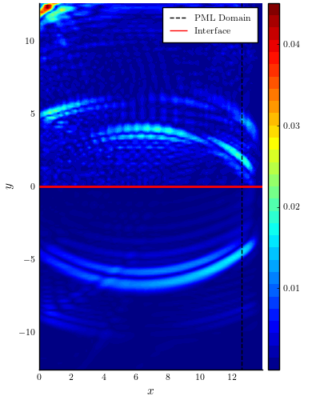

# Summation By Parts

This repository contains the Julia code to solve the elastic wave equation with Perfectly Matched Layers (PML) in layered media. The code can be used to generate the results presented in the accompanying manuscript found on Arxiv: [https://arxiv.org/abs/2210.00229](https://arxiv.org/abs/2210.00229). This code is in v1.0 and will be constantly updated to make it more organised and performant. To use the package, download the latest release and run 

``` julia
julia> ]
pkg> activate /path/to/this/project
julia> using SummationByPartsPML
```

The only method currently available in this repository is the fourth-order Summation By Parts Finite Difference technique `[1]`. To check, run this test snippet:

``` julia
sbp_1d = SBP4_1D(20)
φ(x) = x^2
Dₓ = sbp_1d.D1; Dₓₓ = sbp_1d.D2[1];
using Test
x = LinRange(0,1,20)
@test Dₓ*φ.(x) ≈ 2x.^1
@test Dₓₓ*φ.(x) ≈ 2x.^0
```

An example to solve a 1D Hyperbolic problem is given in the `test/` folder: To run the package testing routine, in the julia terminal, type

```julia
julia> ]
(SummationByPartsPML) pkg>  test SummationByPartsPML
```

Four examples are considered in the paper. 

1) **Two-layer problem:** We consider a two-layer example with discontinuous material properties across an interface. We consider two cases: i) a planar interface and ii) a Gaussian hill interface separating the two layers. We also study the convergence of the PML by comparing with a reference elastic-wave solution computed on a large domain.
2) **Four-layer problem:** This is an extension of the two-layer example, with four layers separated by planar interface.
3) **Marmousi model:** We apply the PML method to the Marmousi model, a real-life elastic wave model.

For the time stepping, we rewrite the wave equation into a system of first-order PDE and use the fourth-order Runge Kutta scheme to discretize the temporal direction.

## How to run the code

To run the codes, stay in the root directory of the package, and run

```julia
julia> include("./examples/2_layer_PML_elastic_wave.jl"); # To run the 2-layer example
```
To change the domain, change the parametric function describing the boundaries of the domain. The argument of the function must $\in [0,1]$. To change the material properties, supply a function of `x` where `x` is a $1 \times 2$ vector. For example, if the function is $f(x,y) = \sin(x)\sin(y)$, then `f(x) = sin(x[1])*sin(x[2])`. The PML width is controlled by `δ` and `σ₀ᵛ, σ₀ʰ`, the strength of the PML along the vertical and horizontal directions. More details of the code will be posted later.

To run the other examples, type

```julia
julia> include("./examples/4_layer_PML_elastic_wave.jl"); # To run the 4-layer example
julia> include("./examples/2_layer_PML_vs_ABC.jl"); # To run the convergence tests
julia> include("./examples/Marmousi2/solver_marmousi2.jl"); # To run the Marmousi2 example
```

NOTE: The examples usually take a while to run.

## 2-layer examples

In this example, we consider the two-layer example with a planar interface. We denote the two layers by $\Omega_1 = [0,4\pi] \times [0,4\pi]$ and $\Omega_2 = [0,4\pi] \times [-4\pi,0]$. We consider an isotropic elastic solid with the material parameters $\rho_1 = 1.5, \mu_1 = 4.86, \lambda_1 = 4.8629$ in $\Omega_1$ and $\rho_2 = 3, \mu_2 = 27, \lambda_2 = 26.9952$ in $\Omega_2$. We set the initial displacements as 

$$
\begin{equation}
\mathbf{u}_1 = \mathbf{u}_2 = e^{-20\left( (x-2\pi)^2 + (y-1.6\pi)^2 \right)}.
\end{equation}
$$

We impose the characteristic boundary conditions at the left bounadry $x=0$, the bottom boundary $y=-4\pi$, and the top boundary $y=4\pi$. Outside the right boundary $x=4\pi$, we use a PML $[4\pi, 4.4\pi] \times [-4\pi, 4\pi]$ closed by the characteristic boundaries at the PML boundaries. Following are results of the simulation for the two-layer elastic media with a planar interface.

Solution at $t = 1$ | Solution at $t = 2$ | Solution at $t = 40$ |
-- | -- | -- |
 |  |  

Curvilinear domains are implemented using the [transfinite interpolation](https://en.wikipedia.org/wiki/Transfinite_interpolation) technique. The boundaries of the domain are parametrized as a mapping from the reference domain $[0,1]$ to the physical domain. The transfinite interpolation will then result in a map between the unit square $[0,1]^2$ and the physical domain. The PDE is then transformed to the reference coordinates and then discretized using the summation-by-parts stencil on the unit square $[0,1]^2$. Following is an example of the elastic-wave equation simulated on a curvilinear layered media. We observe that as the wave propagates into the bottom layer, a portion of it is reflected due to the difference in the material properties.

Solution at $t = 1$ | Solution at $t = 2$ | Solution at $t = 40$ |
-- | -- | -- |
 |  |  

## Convergence of PML

To check the efficacy of the PML, we compare the solution obtained by truncating the domain using the PML and the Characteristic/Absorbing Boundary Condition (ABC). 

 |  |
-- | -- |

We then compare the PML/ABC with the standard elastic-wave reference solution computed on a large domain. This is done by restricting the reference solution within the truncated region corresponding to the PML/ABC and then computing the pointwise maximum norm between the PML/ABC solution (geometry shown in the following Figure). We observe that the error corresponding to the PML solution is less than the ABC solution. This is expected since PML damps out most incoming waves compared to ABC, which damps only those incident waves orthogonal to the boundary. This shows that we indeed get better results by using PML to truncate the domain. We observed upto two-orders of magnitude difference in the errors between PML and ABC solution. We also show an example with the orthotropic/curvilinear media in the manuscript.

 |  |
-- | -- |

## 4-layer example

We also test a layered media problem with more than two layers. In this study, we choose to simulate a problem with four layers, each with distinct material properties. The following table details the material properties on all four layers.

Layer | $\rho$ | $c_s$ | $c_p$ | Domain |
-- | -- | -- | -- | -- |
1 | 1.5 | 1.8 | 3.118 | $[0,40] \times [-10,0]$ |
2 | 1.9 | 2.3 | 3.984 | $[0,40] \times [-20,-10]$ |
3 | 2.1 | 2.7 | 4.667 | $[0,40] \times [-30,-20]$ |
4 | 3 | 3 | 5.196 | $[0,40] \times [-40,-30]$ |

We consider an example where the problem is driven by an explosive moment tensor point source $F(x,y,t) = gM_0f_\delta$, where

$$
\begin{equation}
g=e^{-\frac{(t-0.215)^2}{0.15}},\quad f_{\delta}=\frac{1}{2\pi\sqrt{s_1s_2}}e^{-\left(\frac{(x-20)^2}{2s_1}+\frac{(y+15)^2}{2s_2}\right)},
\end{equation}
$$

where $s_1 = s_2 = 0.5h$ and $M_0 = 1000$. We use a traction free boundary condition at the topmost layer $y = 0$, and PMLs $[-0.4,0] \times [-44,0]$, $[-0.4,44] \times [-44,-40]$ and $[40,44] \times [-44,0]$, all closed by a characteristic boundary condition at the PML boundaries $x = \{-4,44\}, y = -44$. Following figures show the results of the wave propagation across the layers. In the manuscript, we perform a long-time simulation till $T=1000$ and demonstrate the stability of the PML.

Solution at $t = 5$ | Solution at $t = 10$ |
-- | -- |
 | 

## Marmousi Model

We consider the application of the PML to a heterogeneous and discontinuous elastic solid. We use Marmousi2, a large geological dataset based upon the geology from the North Quenguela Trough in the Quanza Basin of Angola. The Marmousi2 `[2]` is a fully elastic model which contains the density of the material and the p−and s−wave speeds. The material is highly heterogeneous containing various structural elements including water, water-wet sand channels, oil-gas mixtures, salt and shale. The full computational model is defined on a rectangular domain $[0.0, 16.9864] \times [−3.4972, −0.44964]$ sampled on a $13601 \times 2801$ uniform grid. Since the primary goal is to demonstrate the stability of the PML, to save computational cost we consider the down-sampled version of the model. Following Figure shows the p-wave speed of the material.

 |
-- |

We convert the full-domain into a two-layers separated by an interface at a naturally occuring non-conformity (as seen from the white lines in the Figure below). We setup the problem with a traction-free boundary condition at the topmost layer, and we use PMLs with characteristic BC at the left and right boundaries. On the bottom boundary, we use an absorbing boundary condition. We simulate the problem with the same external source as in the 4-layer case, but at three different points in the domain. Following figures show the evolution of the solution at $t = 0.5$ (top) and $t=1$ (bottom)

 | 
-- |
 | 

# References

[1] Mattsson, Ken, and Jan Nordström. "Summation by parts operators for finite difference approximations of second derivatives." Journal of Computational Physics 199.2 (2004): 503-540.

[2] Martin, Gary S., Robert Wiley, and Kurt J. Marfurt. "Marmousi2: An elastic upgrade for Marmousi." The leading edge 25.2 (2006): 156-166.
